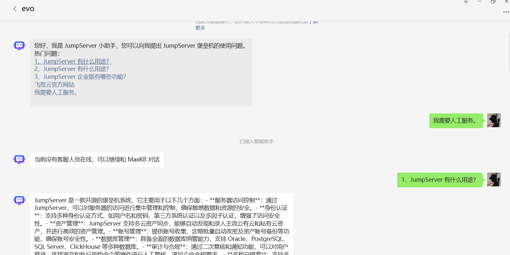
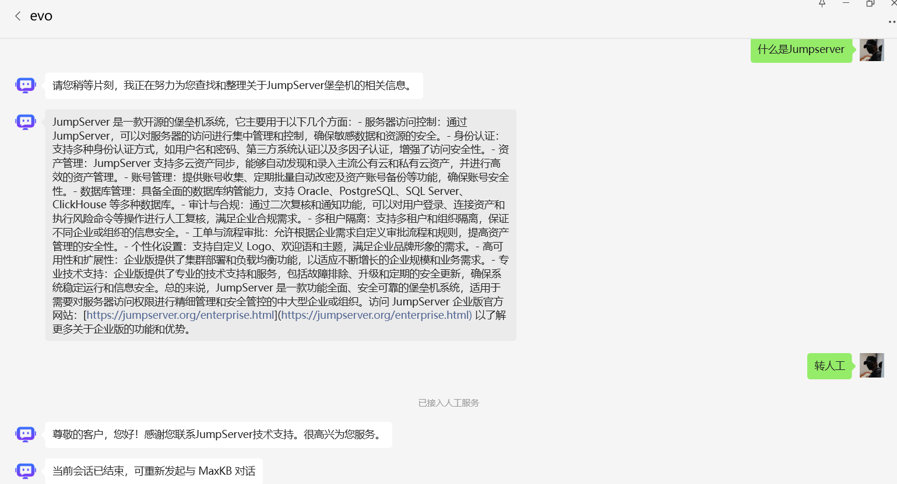
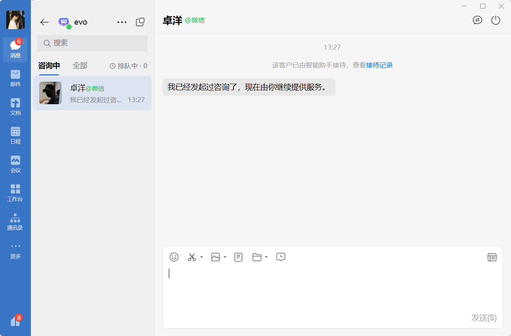
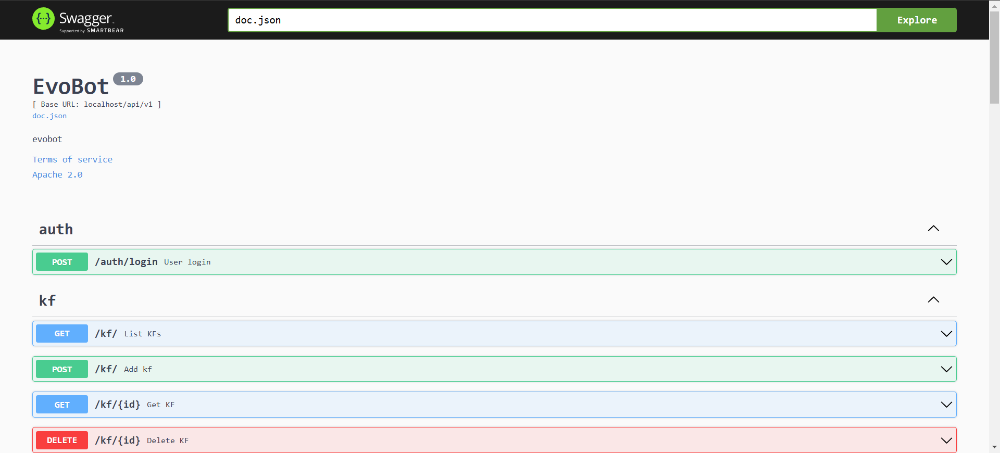

# 是什么
基于知识库系统或大语言模型以辅助的智能客服解决方案

# 部署
本项目由 go 语言开发 go version go1.23.2

配置文件例，cmd\server\conf\config-example.yaml

部署 Mysql>= 5.7 utf8mb4，Redis>= 6.0

安装依赖 go mod tidy

直接运行

go run .\cmd\server\main.go -c .\cmd\server\conf\config.yaml

构建二进制文件

go build -o evobot

swagger 页面：http://127.0.0.1:24916/swagger/index.html

健康检查页面：http://127.0.0.1:24916/health

# 使用
企微后台创建自建应用对接本服务，开放微信客服 api 权限给自建应用并创建客服

暂无前端，接口调用以配置使用

# 展示

